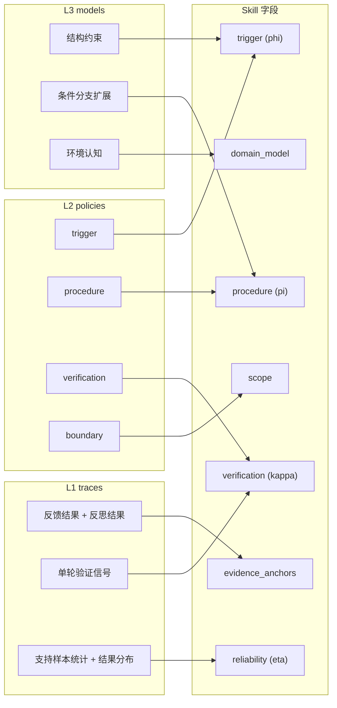
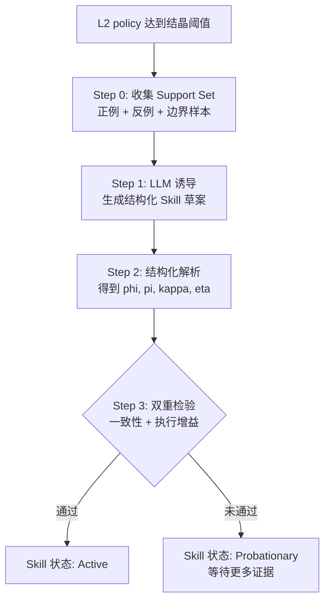
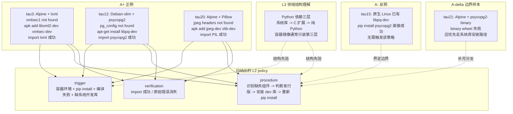
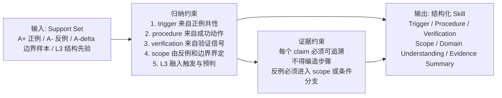
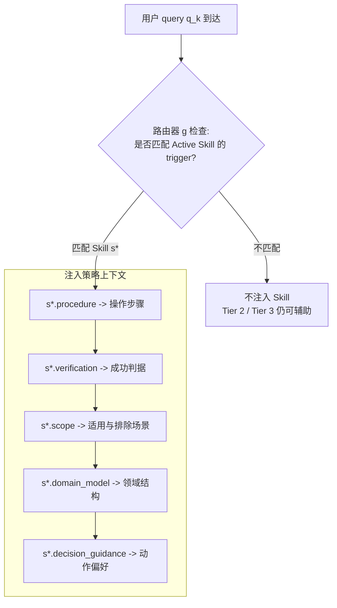
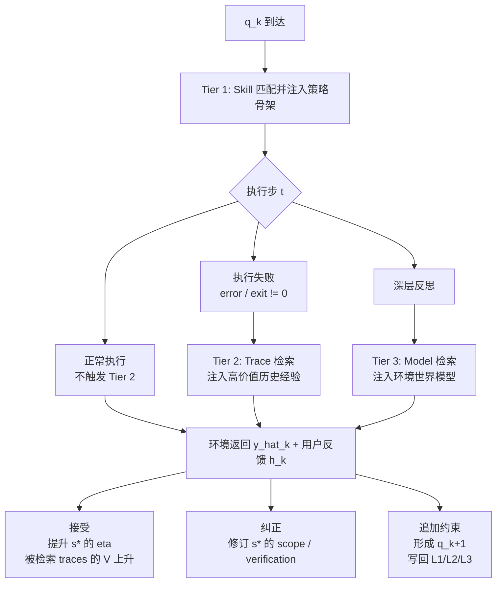

#  交互驱动的智能体自我进化框架

> **核心立场**：智能体的能力提升不应依赖离线日志分析或人工编写的技能模板，而应在与环境和人类的持续交互中自主实现。Skill 沉淀只是自我进化过程的一个具体产出——更根本的是，智能体通过分层记忆的持续积累与修订，实现对环境的理解越来越深、对任务的处理越来越快、与人类偏好越来越对齐。

> **阅读顺序提示**：第一次接触本文档的同学请先看 [`GRANULARITY-AND-MEMORY-LAYERS.md`](./GRANULARITY-AND-MEMORY-LAYERS.md)，把"小步 / 轮 / 任务"和"经验 / 环境认知 / 技能"几个粒度概念锁死，再回来读本文。

---

## 双层反馈机制驱动的持续自我进化

Reflect2Evolve 核心机制是：通过双层反馈机制，将交互经验沉淀为分层记忆，从记忆中结晶可调用能力，并在后续交互中持续修订——使智能体越用越智能。它有两个同时运转的关键过程：

### 0.1 步级决策过程：模型-环境交互

对于一次用户请求，Agent 在环境中反复执行：

> **query → context → 指令 → 执行 → 反馈结果 → 反思结果 → 下一轮指令**

步级决策过程中的每一次迭代都会产生一个 grounded trace：

$$
f^{(1)}_{k,t} = (s_{k,t},\; a_{k,t},\; o_{k,t},\; \rho_{k,t},\; r_{k,t})
$$

其中：

- $k$ 表示当前用户任务轮次
- $t$ 表示该任务内部的第 $t$ 个执行步
- $s_{k,t}$ 是当前步骤可见的状态/上下文
- $a_{k,t}$ 是模型采取的动作（action）
- $o_{k,t}$ 是环境返回的 observation / feedback
- $\rho_{k,t}$ 是模型基于 $o_{k,t}$ 产生的 reflection
- $r_{k,t} \in [-1, 1]$ 是该步的**效用值**，默认由任务级反馈过程中的终局奖励通过**反思加权回溯**填充（见 0.6 节）

### 0.2 任务级反馈过程：人类-模型协同修正

真正的任务完成并不由环境单独决定，而由**人类是否满意**决定。一次完整的任务级反馈过程是：

$$
q_k \;\rightarrow\; \{f^{(1)}_{k,1}, \ldots, f^{(1)}_{k,T_k}\} \;\rightarrow\; \hat{y}_k \;\rightarrow\; h_k \;\rightarrow\; q_{k+1}
$$

其中：

- $q_k$：用户当前给出的 query / 需求
- $\{f^{(1)}_{k,t}\}$：本轮任务内部的步级决策序列
- $\hat{y}_k$：本轮系统返回给用户的结果
- $h_k$：用户反馈，可能是接受、纠正、补充约束、要求重做、提出新 query
- $q_{k+1}$：用户基于本轮结果继续给出的下一轮 query

**关键判断：$q_{k+1}$ 是修正还是新任务？**

当 $q_{k+1}$ 到达时，系统首先判断其与 $q_k$ 的关系——这直接决定了记忆如何更新：

| 判断类型 | 判定依据 | 系统行为 |
|---------|---------|---------|
| **修正（Revision）** | $q_{k+1}$ 引用了 $\hat{y}_k$ 的具体内容、指出错误、或追加约束（如“不对，应该用另一种方式”“加一个条件”） | 继续当前 session：本轮 L1 traces 与 $q_k$ 的 traces 属于同一 episode，$h_k$ 的 $R_{\text{human}}$ 回溯修正 $q_k$ 轮所有 traces 的 $V$ 值，修订相关 L2/L3 |
| **新任务（New task）** | $q_{k+1}$ 的目标/领域与 $q_k$ 无关，不引用 $\hat{y}_k$（如“现在帮我处理另一个问题”） | 关闭当前 session：$q_k$ 轮的 episode 封存，$h_k$ 作为终局信号完成 credit assignment；新 session 以空 episode 开始，但通过 Tier 1/2/3 检索历史记忆 |
| **追问（Follow-up）** | $q_{k+1}$ 在同一领域内提出延伸需求，但不否定 $\hat{y}_k$（如“好了，那再帮我处理下一个类似的”） | 延续 session 但开新 episode：当前 episode 标记为成功封存，新 episode 继承上下文但独立计算 $V$ |

**判定方式**：从 $q_{k+1}$ 中提取意图信号——是否包含否定/修正词（“不对”“重做”）、是否引用 $\hat{y}_k$ 内容、是否与 $q_k$ 的领域标签一致。可用规则匹配 + LLM 轻量判断实现。

这个判断的意义在于：**修正型反馈是最有价值的学习信号**（它明确告诉系统“哪里错了”），而新任务的开始意味着上一轮的学习窗口已关闭。区分两者，才能正确地进行 credit assignment 和 episode 管理。

### 0.3 自我进化发生在两个时间尺度上

- **步级更新**：每一轮步级决策后，系统立即写入或修正 L1 trace
- **任务级更新**：每一次用户反馈到来后，系统会回看本轮已有的 L1/L2/L3，判断哪些该保留、哪些该修正、哪些需要降权或扩边界

因此 Reflect2Evolve 的进化对象不是“静态日志”，而是一个持续被新反馈重写的交互历史——智能体通过它越来越聪明。

### 0.4 自我进化沉淀什么

系统在交互过程中持续加工并沉淀三类长期对象：

1. **L1 trace memory $\mathcal{M}^{(1)}$**
   存储单轮 grounded trace，回答“这一步做了什么，发生了什么，模型如何解释它”。
2. **L2 policy memory $\mathcal{M}^{(2)}$**
   存储可复用的子任务策略，回答“在什么条件下应该怎么做，如何验证，边界在哪”。
3. **L3 world model $\mathcal{M}^{(3)}$（环境世界模型）**
   存储智能体通过反复交互积累起来的**对环境的压缩认知**——用一句话说：**L1 记录"发生了什么"，L2 记录"该怎么做"，L3 记录"这个环境长什么样"**。
   
   举一个最直观的例子：Agent 第一次在项目目录下工作时，需要反复 `ls` 各个目录才能知道代码在哪、测试在哪、配置文件在哪。执行了几轮后，L3 会沉淀出这样的环境认知：
   
   ```
   项目结构认知：
   ├── src/components/  → React 组件（.tsx）
   ├── src/utils/       → 工具函数
   ├── tests/           → 测试文件（pytest）
   ├── .env             → 环境变量配置
   ├── docker-compose.yml → 容器编排
   └── 构建命令：npm run build（前端），pytest（测试）
   ```
   
   有了这条 L3，下次用户说“帮我改一下登录组件”，Agent 直接去 `src/components/` 而不用再探索；用户说“跑一下测试”，Agent 直接执行 `pytest` 而不用先查构建系统——**每一条 L3 知识都省掉了未来的探索步骤和 Token**。
   
   L3 包含三类压缩认知：
   - **空间结构 $\mathcal{E}$**：环境中什么东西在哪——目录结构、代码架构、服务拓扑、配置文件位置
   - **行为规律 $\mathcal{I}$**：环境对动作的典型响应——“这个 API 返回 JSON”、“构建必须先 compile 再 link”、“改配置后要重启服务”
   - **约束与禁忌 $\mathcal{C}$**：不能做什么——“这个目录是只读的”、“macOS 的 sed 和 Linux 语法不同”、“生产环境不能直接 DROP TABLE”
   
   **L3 的核心价值**：没有 L3 的智能体每次都要**重新探索**环境（花费大量步骤和 Token），有 L3 的智能体直接**凭记忆导航**——就像一个熟悉项目的开发者不需要翻目录就知道代码在哪。这是从“反复摸索”到“直接知道”的质变。

在此基础上，系统维护可调用的技能库 $\mathcal{S}$。Skill 不是单独凭空生成的，而是从 $\mathcal{M}^{(2)}$ 和 $\mathcal{M}^{(3)}$ 中结晶，并持续被新的 $\mathcal{M}^{(1)}$ 和用户反馈修订。这四类对象共同构成智能体的**长期认知状态**——自我进化的载体。

### 0.5 在线自我进化的更新规则

对每一轮用户反馈 $h_k$，系统执行四类更新：

- **写入 + L2 关联检查**：将本轮新的步级决策 traces 写入 $\mathcal{M}^{(1)}$；每条新 L1 trace 写入时，立即检查是否匹配已有 L2 的 trigger pattern——若匹配则关联并更新该 L2，若不匹配则暂存为候选，等待后续相似 trace 到来后共同诱导新 L2
- **抽象**：从多个相互一致的 L2 中抽象 L3 world model，更新 $\mathcal{M}^{(3)}$
- **修订**：若用户指出结果错误、不完整、或需附加约束，则反向修订已有的 L1/L2/L3 及其 reliability

可形式化写成：

$$
(\mathcal{M}^{(1)}, \mathcal{M}^{(2)}, \mathcal{M}^{(3)}, \mathcal{S})_{k+1}
=
\mathcal{U}\big(
(\mathcal{M}^{(1)}, \mathcal{M}^{(2)}, \mathcal{M}^{(3)}, \mathcal{S})_k,\;
q_k,\; \{f^{(1)}_{k,t}\},\; \hat{y}_k,\; h_k
\big)
$$

这里的 $\mathcal{U}$ 不是一次性训练，而是**在线、增量、可反悔**的自我进化算子。

### 0.6 反馈效用量化：文本反馈如何变成数值信号

智能体的反馈全是文本（环境输出 $o_t$、模型反思 $\rho_t$、用户反馈 $h_k$），但量化决策（哪些经验该保留？哪些 policy 真正有效？）需要数值信号。Reflect2Evolve 的核心思路是：**以任务级反馈过程中的人类反馈为锚点，通过反思加权回溯为每一步分配价值**——类似 RLHF 中从最终奖励向前传播 credit 的方式，但显式区分“关键发现”和“盲目试错”。

#### 终局奖励 $R_{\text{human}}$：任务级反馈过程的数值锚点

每一轮任务级反馈结束时，用户反馈 $h_k$ 是唯一的确定性评判。系统将 $h_k$ 连同本轮任务摘要一起交给 LLM，按预定义的评分规则（scoring rubric）输出终局奖励标量：

**评分规则（Scoring Rubric）**：

| 评分维度 | 说明 | 分值范围 |
|---------|------|---------|
| 目标达成度 | 用户的核心需求是否被满足 | −1 ~ +1 |
| 过程质量 | 是否走了不必要的弯路、是否遵守了用户约束 | −0.5 ~ +0.5 |
| 用户满意信号 | 反馈中的情感倾向（肯定/否定/中性） | −0.5 ~ +0.5 |

$$R_{\text{human}}(h_k) = \text{LLM\_Score}\big(h_k,\; \text{task\_summary}_k,\; \text{rubric}\big) \in [-1, 1]$$

LLM 根据 rubric 对三个维度分别打分后加权合并，输出一个连续的 $[-1, 1]$ 标量。相比简单的关键词匹配，LLM 评分能理解"方向对但细节需要调整"和"完全错误"之间的差异，产出更细粒度的终局信号。

#### 回溯价值 $V(f^{(1)})$：从终局奖励向前传播

$R_{\text{human}}$ 确定后，系统需要将这个任务级信号分配回每一步。纯 $\gamma$-折扣回溯（离终点越远价值越低）对长任务不公平——一个复杂任务前期的关键探索步骤同样重要。因此 Reflect2Evolve 采用**反思加权回溯（Reflection-weighted Backpropagation）**：

$$
V(f^{(1)}_{k,T_k}) = R_{\text{human}}(h_k), \quad V(f^{(1)}_{k,t}) = \alpha_t \cdot R_{\text{human}}(h_k) + (1 - \alpha_t) \cdot \gamma \cdot V(f^{(1)}_{k,t+1})
$$

其中 $\alpha_t \in [0, 1]$ 是第 $t$ 步的**反思质量权重**，由 LLM 根据该步反思 $\rho_t$ 的内容评估：

| 反思信号 | $\alpha_t$ 取值 | 含义 |
|---------|----------------|------|
| 反思识别出关键发现（如定位到根因、发现正确路径） | 高（0.6–0.8） | 该步有实质性认知贡献，直接继承终局价值 |
| 反思确认操作成功、常规推进 | 中（0.3–0.5） | 正常推进，混合折扣和终局信号 |
| 反思指出当前步是盲目探索、未获得有效信息 | 低（0.0–0.2） | 纯试错，主要靠后续步骤的折扣传播 |

$\gamma \in (0, 1)$ 为折扣因子（默认 0.9）。这个设计的效果是：

- **有实质认知贡献的步骤**（$\alpha_t$ 高）：无论在轨迹的什么位置，都能获得接近 $R_{\text{human}}$ 的价值——长任务的关键探索步不会被埋没
- **纯试错步骤**（$\alpha_t$ 低）：主要靠 $\gamma$-折扣从后续步骤传播价值，自然衰减
- **失败任务**：$R_{\text{human}} < 0$，所有步骤的 $V$ 为负，但其中识别出"此路不通"的反思步骤（$\alpha_t$ 高）会获得较高的负值——在后续 Decision Repair 中，这些步骤恰好成为反模式的核心证据

**奖励函数的作用**并不是直接更新大模型参数，而是为交互记忆提供统一的价值刻画。具体来说，它至少承担四个作用：

1. **credit assignment**：把任务级的人类反馈分配回步骤级轨迹，区分“哪些步骤真正有贡献，哪些只是盲试”。
2. **记忆分级**：高价值 trace 在检索中获得更高优先级，低价值 trace 自然沉底但永久保留——记忆库不丢弃任何经验，只做优先级排序。
3. **策略归纳与 Skill 结晶**：当某类动作模式在多轮交互中持续获得高价值时，它才有资格上升为 L2 policy 或进一步结晶为 Skill。
4. **决策修复**：在相同 context 下，对比不同动作的价值分布，提炼出“优先做什么、避免做什么”的动作偏好和反模式。

**完整链路示意：**

| 阶段 | 输入 | 核心操作 | 输出 |
|------|------|----------|------|
| **Step 1: 汇总终局信号** | 用户反馈 $h_k$ + 本轮任务摘要 $\text{task\_summary}_k$ | 将人类文本反馈和本轮执行摘要打包，形成统一评分上下文 | 评分输入上下文 |
| **Step 2: 终局奖励估计** | 评分输入上下文 + scoring rubric | LLM 按“目标达成度、过程质量、用户满意信号”三个维度打分并加权合并 | 终局奖励 $R_{\text{human}}(h_k) \in [-1, 1]$ |
| **Step 3: 反思质量评估** | 每一步的反思 $\rho_t$ | 估计该步是否识别出关键发现、正常推进、或只是盲试 | 反思权重 $\alpha_t \in [0, 1]$ |
| **Step 4: 价值回填** | $R_{\text{human}}$、$\alpha_t$、轨迹 $\{f^{(1)}_{k,t}\}$ | 从后向前进行 reflection-weighted backpropagation | 每条 L1 trace 的步骤价值 $V(f^{(1)}_{k,t})$ |
| **Step 5: 下游使用** | 步骤价值 $V(f^{(1)}_{k,t})$ | 用于检索排序、L2 诱导、Skill 结晶、Decision Repair | 价值驱动的记忆更新与策略进化 |

终局奖励由人类反馈驱动：

$$
\begin{aligned}
R_{\text{human}}(h_k)
&=
\text{LLM\_Score}\!\left(
h_k,\;
\text{task\_summary}_k,\;
\text{rubric}
\right) \\
&\in [-1,1]
\end{aligned}
$$

其中，rubric 至少覆盖三类信息：

- **目标达成度**：最终结果是否真正满足用户需求
- **过程质量**：是否遵守约束、是否出现不必要的弯路
- **用户满意信号**：文本反馈中的肯定、否定、修正、保留意见

得到 $R_{\text{human}}$ 后，系统把任务级信号分配回每一步：

$$
V\!\left(f^{(1)}_{k,T_k}\right)=R_{\text{human}}(h_k)
$$

$$
\begin{aligned}
V\!\left(f^{(1)}_{k,t}\right)
&=
\alpha_t \, R_{\text{human}}(h_k)
+
\left(1-\alpha_t\right)\gamma
V\!\left(f^{(1)}_{k,t+1}\right), \\
&\qquad t=T_k-1,\dots,1
\end{aligned}
$$

其中：

- $\alpha_t$：由 LLM 根据 $\rho_t$ 的反思质量评估得到；若该步识别出关键发现，则 $\alpha_t$ 高；若只是盲目试错，则 $\alpha_t$ 低
- $\gamma$：折扣因子，控制后续步骤对当前步骤的回传强度
- $V(f^{(1)}_{k,t})$：第 $t$ 步 trace 的最终价值，用来刻画“这一步对任务成功究竟有多大贡献”

更具体地说，$V$ 不只是一个打分，而是后续自我进化的统一驱动信号：

| $V$ 的用途 | 具体作用 |
|-----------|----------|
| **检索排序** | 高价值 trace 在 Tier 2 检索中优先返回，降低重复试错 |
| **L2 诱导** | 跨任务归纳时，高价值 traces 对 trigger / procedure / scope 的影响更大 |
| **Skill 结晶** | 只有持续产生正增益的 L2 policy 才有资格结晶成 Skill |
| **Decision Repair** | 同一 context 下，对比高 $V$ 与低 $V$ 动作，生成 preference / anti-pattern |

#### 效用信号驱动的三个关键决策

1. **Value-weighted 归纳**：跨任务 L1 traces 关联 / 诱导 L2 时，各 trace 按价值加权，高价值经验对 policy 的影响更大：
   $$w_t = \text{softmax}\big(V(f^{(1)}_t)\, /\, \tau\big)$$

2. **Value-guided 降权**：$\mathcal{M}^{(1)}$ 中的每条 trace 持有一个检索优先级权重，同时考虑价值和时效：
   $$\text{priority}(f^{(1)}) \propto \max\big(V(f^{(1)}),\; 0\big) \cdot \text{decay}(\Delta t)$$
   低价值 + 长期未引用的 trace 检索优先级降低，但**永久保留在磁盘上**——它们仍可在未来被新的反思或 Decision Repair 重新激活。

3. **Policy gain 量化**：L2 policy 的效用增益通过对比"有策略"和"无策略"两组历史执行的平均价值来计算，并在缺乏对照时用一个中性先验（neutral baseline）做 Bayesian shrinkage：
   $$G(f^{(2)}) = \bar{V}_{\text{with}} - \tilde{V}_{\text{without}}$$
   $$\tilde{V}_{\text{without}} = \frac{\bar{V}_{\text{without}} \cdot n_{\text{without}} + V_0 \cdot N_0}{n_{\text{without}} + N_0}$$
   其中：
   
   - $\bar{V}_{\text{with}}$：**调用了该 policy 的所有 episode** 中，相关步骤的 $V$ 值均值（softmax 加权，τ 由 `algorithm.reward.tauSoftmax` 控制）。来源是 $\mathcal{M}^{(1)}$ 中标记了 `policy_id = f^{(2)}` 的 traces。
   - $\bar{V}_{\text{without}}$：**同类任务中未调用该 policy 的 episode** 中，对应步骤的 $V$ 值算术均值。通过同 episode 中其他 trace 或 Tier 2 检索匹配相同 context 但无 policy 标记的历史 traces 获得。
   - $V_0 = 0.5$：V7 §0.6 评分 rubric 中的中性参考（"无信号"对应 $R_{\text{human}}$ 中点；典型成功 episode 的 $V$ 在 $0.5$–$0.85$ 之间，失败在 $< 0.5$）。
   - $N_0 = 5$：先验的虚拟样本数（pseudocount）。早期对照证据稀少时先验主导，后期实测主导，平滑过渡。
   
   **为何引入 shrinkage？** 真实交互场景里几乎所有 episode 都被评为成功（$R_{\text{human}} \approx 0.6$–$0.85$），加上 reward 反向传播会把相近 $V$ 值散布到所有步骤的 trace 上，于是 $\bar{V}_{\text{without}}$ 几乎必然贴近 $\bar{V}_{\text{with}}$，原始 V7 公式得分恒为 $\approx 0$，任何 policy 都升不上 active。中性先验保证了：真正有用的 policy（with-set $V \approx 0.8$）即使没有显式失败对照也能拿到 $G \approx 0.3$ 的正分；中性 / 有害 policy 维持 $G \le 0$ 被自然过滤。当真实对照证据累计到 $n_{\text{without}} \gg N_0$ 时，公式平滑回退到原始 V7 §0.6 形式。
   
   $G > 0$ 说明这个 policy 确实提升了执行质量；$G \leq 0$ 则说明它没有价值甚至有害。Skill 的 reliability $\eta$ 从"成功次数统计"升级为"期望效用增益"。

### 0.7 为什么它能实现智能体的持续自我进化

随着任务级反馈过程持续展开，智能体会在五个维度上实现自我进化：

1. **更强的证据感知**：L1 让模型不再依赖模糊印象，而能回到具体执行证据。
2. **更快的策略调用**：L2 让模型不必每次从零试错，而能直接调用已有子任务策略。
3. **更深的环境认知**：L3 让模型凭积累的世界模型直接导航，跳过探索步骤，大幅节省 Token。
4. **更稳定的人类对齐**：任务级反馈过程中的用户反馈不断修订边界、可靠性和优先级，使系统不只是“会做”，而是“越来越符合用户想要的做法”。
5. **更精准的记忆管理**：效用信号为每条经验标注优先级——高价值经验在检索中优先浮现，低价值经验自然沉底但不丢弃。进化不只是"积累更多"，而是"让好经验更容易被找到"。

---

## 一、分层反馈认知：从 Agent 执行循环中提取

Agent 的执行不是“只看 observation”的单点事件，而是一个反复展开的循环：

> **query → context → 指令 → 执行 → 反馈结果 → 反思结果 → 下一轮指令**

Reflect2Evolve 从这个交互循环中逐级沉淀出三种认知对象——智能体自我进化的认知基石：

- **L1：step-level grounded trace**
  单轮执行循环的 grounded 记录，保留 `指令 / 执行 / 反馈 / 反思` 的最小决策单元。
- **L2：subtask policy**
  当**不同任务**中反复出现相同类型的子问题时，系统从跨任务的相似 L1 traces 中归纳出的可复用策略。L2 不是单个任务的步骤总结，而是跨任务发现的可迁移子问题解法，必须具备 `trigger / procedure / verification / boundary` 四个要素。
- **L3：world model（环境世界模型）**
  当智能体在同一个环境/领域中反复交互后，从累积的 L2 策略和 L1 traces 中提炼出的**压缩环境认知**。L2 告诉智能体“该怎么做”，L3 告诉智能体“这个环境长什么样”——包括空间结构（什么东西在哪）、行为规律（环境如何响应）、约束禁忌（什么不能做）。有了 L3，智能体不需要重新探索就能直接导航，大幅节省步骤和 Token。

形式化定义如下。L1 trace：

$$
f^{(1)} = (s_t,\; a_t,\; o_t,\; \rho_t,\; r_t)
$$

其中 $s_t$ 为当前步骤状态，$a_t$ 为执行动作，$o_t$ 为环境 observation / feedback，$\rho_t$ 为基于反馈产生的反思，$r_t \in [-1, 1]$ 为该步的效用值（由任务级反馈过程中的终局奖励回溯填充）。

L2 policy 写成：

$$
f^{(2)} = (\phi,\; \pi,\; \kappa,\; \Omega,\; \{f^{(1)}\})
$$

其中 $\phi$ 是触发条件，$\pi$ 是 procedure，$\kappa$ 是 verification / fallback，$\Omega$ 是适用边界。

L3 world model 写成：

$$
f^{(3)} = (\mathcal{E},\; \mathcal{I},\; \mathcal{C},\; \{f^{(2)}\})
$$

其中 $\mathcal{E}$ 是空间结构（环境中什么东西在哪），$\mathcal{I}$ 是行为规律（环境对动作的典型响应），$\mathcal{C}$ 是约束与禁忌（不能做什么）。

以下先给一个最小直觉例子帮助理解三层认知，再给两个**真正展示跨任务 L2 归纳**的正式场景。

---

### 一个最小直觉例子：项目目录探索（仅用于理解三层认知）

**任务**：用户让 Agent 在一个新项目中工作。

#### L1：单步执行 trace

| 步骤 | 指令 | 观测 | 反思 |
|------|------|------|------|
| 1 | `ls ~/project/` | `src/  tests/  docs/  .env  package.json` | 这是一个 Node.js 项目 |
| 2 | `ls ~/project/src/` | `components/  utils/  api/  App.tsx` | 前端 React 项目，组件在 components |
| 3 | `cat ~/project/.env` | `DB_HOST=localhost  DB_PORT=5432` | 数据库用的 PostgreSQL |
| 4 | 用户说"帮我改登录页面" → Agent 先 `ls src/components/` 找到 `Login.tsx` | 成功找到并修改 | 以后类似需求直接去 components |

每一步是一条 L1 trace。

#### L2：子任务策略（跨任务归纳）

Agent 在**多个不同任务**中反复遇到"用户要求修改某个组件"的子问题——每次新 L1 trace 写入时触发模式检查，发现这些来自不同任务的 traces 共享相同的子问题结构，于是归纳出 L2 policy：

> **trigger**：用户要求修改某个前端组件
> **procedure**：直接去 `src/components/` 查找对应 `.tsx` 文件
> **verification**：文件存在且包含 React 组件导出
> **boundary**：仅适用于前端组件；后端逻辑在 `src/api/`

#### L3：环境世界模型（从多条 L2 + L1 提炼）

多个 L2 策略指向同一个项目后，Agent 沉淀出整个项目的压缩认知：

| 类型 | 路径 / 规则 | 说明 |
|:---:|:---|:---|
| 📂 | `src/components/` | React 组件（Login, Dashboard, Settings…） |
| 📂 | `src/utils/` | 工具函数（format, validate, auth…） |
| 📂 | `src/api/` | 后端 API 路由 |
| 📂 | `tests/` | 测试文件（与 src 目录结构镜像） |
| 📄 | `.env` | 数据库配置（PostgreSQL, localhost:5432） |
| 🔨 | 构建 | `npm run build` → 编译前端 |
| 🧪 | 测试 | `npm test` → 运行 jest |
| 🚫 | 约束 | 不要直接改 `node_modules/`；`.env` 不要提交到 git |

**L3 的直接效果**：
- **无 L3 时**：每次任务都要先 `ls` 多个目录探索结构，花费 5-10 步 + 大量 Token
- **有 L3 时**：直接"知道"目标在哪，一步到位，节省 80% 的探索步骤

这就是三层认知最本质的区别：**L1 = 原始记忆，L2 = 操作手册，L3 = 环境地图**。

---

### 场景 1：容器环境依赖安装 — 跨项目 L2 归纳

本场景演示 L2 如何**真正从不同任务中**通过增量式检查形成。

#### Round 1 · 任务 A："在 Alpine Docker 安装 lxml"

**L1 traces（来自任务 A）：**

| trace | 动作 | 观测 | 反思 | α |
|-------|------|------|------|---|
| $f^{(1)}_{1,1}$ | `pip install lxml` | `Error: xmlsec1 not found` | "Alpine 缺 C 库 xmlsec1" | 0.7（关键发现） |
| $f^{(1)}_{1,2}$ | `apk add libxml2-dev && pip install lxml` | 安装成功 | "Alpine 需先装系统库再源码编译" | 0.5 |

**用户反馈 $h_1$**："可以了" → $R_{\text{human}} = +0.8$

**增量式 L2 关联检查**：新 traces 写入 → 检索已有 L2 → **无匹配** → 标记为候选，进入候选池：

| Trace | 环境 | 动作 | 结果 | V |
|:---:|:---|:---|:---|:---:|
| $f_{1,1}$ | Alpine | `pip install lxml` | 系统库缺失 | **+0.62** |
| $f_{1,2}$ | Alpine | `apk add` + `pip` | ✅ 成功 | **+0.80** |

> 🏷 **标签**：`容器` · `pip 编译失败` · `系统库缺失`  
> ⏳ 等待跨任务相似 trace 触发 L2 诱导

> **Round 1 结果**：有 L1 traces，**尚无 L2**。

#### Round 2 · 任务 B："部署 Django Web 应用到 Docker"（完全不同的任务目标）

**L1 traces（来自任务 B）：**

| trace | 动作 | 观测 | 反思 | α |
|-------|------|------|------|---|
| $f^{(1)}_{2,1}$ | `pip install psycopg2`（部署过程中） | `Error: pg_config executable not found` | "容器中缺少 PostgreSQL 开发库" | 0.6 |

**⚡ 增量式 L2 关联检查 — 跨任务模式发现！**

新 L1 trace $f^{(1)}_{2,1}$ 写入 → 检索候选池 → 发现 $f^{(1)}_{1,1}$ 的 error pattern（容器 + pip 编译失败 + 系统库缺失）**高度相似**。两个 trace 来自完全不同的任务（任务 A 是安装 lxml，任务 B 是部署 Django 应用），但遇到了**相同类型的子问题**。

→ **诱导新 L2 policy**：

> **L2 policy: 容器环境系统库缺失排障策略**  
> **trigger**：容器中 `pip install` 因系统库缺失导致编译失败。  
> **procedure**：  
> 1. 解析错误信息，识别缺失的系统组件名；  
> 2. 按容器发行版选择包管理器（Alpine → `apk add`，Debian → `apt-get install`）；  
> 3. 安装对应的 `-dev` 开发库；  
> 4. 重新执行 `pip install`。  
> **verification**：`import <module>` 成功。  
> **boundary**：容器环境（Docker/CI）；不适用于已有 dev 库的原生系统。  
> **来源 traces**：$f^{(1)}_{1,1}$（任务 A · Alpine + lxml）+ $f^{(1)}_{2,1}$（任务 B · Docker + psycopg2）

| trace | 动作 | 观测 | 反思 |
|-------|------|------|------|
| $f^{(1)}_{2,2}$ | `apt-get install libpq-dev && pip install psycopg2` | 安装成功 | "策略有效" |

**用户反馈 $h_2$**："部署成功" → $R_{\text{human}} = +0.9$ → L2 η 上升。

#### L3：Python 包依赖模型

随着更多类似 L2 积累（如 cryptography 需要 Rust 编译器、Pillow 需要 jpeg-dev），系统抽象出环境世界模型：

> **L3 model**：Python 包依赖分**三层结构**：  
> **系统库** → **C 扩展** → **纯 Python**。  
> 容器镜像通常只有第三层。判断目标包属于哪一层，可预判是否需要系统依赖。  
> C 扩展类包的特征：`setup.py` 中有 `ext_modules`，或依赖 `cffi/cython`。

#### 任务级反馈过程驱动进化

用户后续反馈："在 Alpine 上别用 binary wheel，musl 不兼容。" → L2 的 boundary 新增 Alpine/musl 分支 + Decision Repair 生成 anti_pattern。

> 关键区别：**L2 不是"任务 A 的步骤总结"**，而是从任务 A（Alpine + lxml）和任务 B（Docker + psycopg2）中**跨任务发现的可迁移子问题策略**。

---

### 场景 2：标识命名一致性 — 跨领域 L2 归纳

#### Round 1 · 任务 A："把 MemOS 插件接入 OpenClaw"

**L1 traces（来自任务 A）：**

| trace | 动作 | 观测 | 反思 |
|-------|------|------|------|
| $f^{(1)}_{3,1}$ | `openclaw plugins install memos-plugin` | `Error: plugin id mismatch (manifest: "memos-local", entry: "local-openclaw")` | "manifest id、npm 包名、入口导出 id 三者不一致" |
| $f^{(1)}_{3,2}$ | 统一命名后重新安装 | 安装成功 | "命名一致性是关键检查点" |

**用户反馈 $h_3$**："可以，以后优先检查命名一致性" → $R_{\text{human}} = +0.8$

**L2 关联检查**：无匹配 → 候选池。

#### Round 2 · 任务 B："发布 analytics-sdk 到内部 NPM registry"（完全不同的任务领域）

**L1 trace（来自任务 B）：**

| trace | 动作 | 观测 | 反思 |
|-------|------|------|------|
| $f^{(1)}_{4,1}$ | `npm publish --registry=https://npm.internal.com` | `Error: package name "analytics-sdk" doesn't match scope "@company/analytics"` | "package.json 的 name 和 registry scope 不一致" |

**⚡ 跨任务模式发现！**

$f^{(1)}_{4,1}$ 的 error pattern = "标识/命名不一致导致注册/发布失败" — 与候选池中 $f^{(1)}_{3,1}$（插件 id mismatch）模式高度相似。

→ **诱导新 L2 policy**：

> **L2 policy: 标识一致性校验策略**  
> **trigger**：注册/发布/安装阶段出现标识命名不匹配错误。  
> **procedure**：  
> 1. 先检查所有标识命名是否一致（manifest id / package name / entry export id / registry scope）；  
> 2. 统一修正命名后重试。  
> **verification**：注册/发布命令成功执行。  
> **boundary**：适用于有标识校验的包管理系统 / 插件系统。  
> **来源 traces**：$f^{(1)}_{3,1}$（任务 A · 插件注册）+ $f^{(1)}_{4,1}$（任务 B · NPM 发布）

| trace | 动作 | 观测 | 反思 |
|-------|------|------|------|
| $f^{(1)}_{4,2}$ | 修正 package name 为 `@company/analytics`，重新 publish | 发布成功 | "标识一致性策略有效" |

**用户反馈 $h_4$**："好的" → $R_{\text{human}} = +0.9$ → L2 η 上升 → 达到 Skill 结晶阈值。

#### L3：包管理系统的标识校验模型

> **L3 model**：包管理 / 插件系统加载遵循**分层校验管线**：  
> `标识声明 → 代码加载 → 导出校验 → 注册钩子 → 运行时依赖`。  
> 不同报错对应不同层。调试应先定位层，再选策略。

#### 任务级反馈过程驱动进化

后续用户反馈："Python 插件不支持" → L2 boundary 收缩："仅适用于 JS/TS 插件系统"。

> 这个 L2 跨越了**两个完全不同的领域**（插件注册 vs NPM 发布），但抽象出了一个**通用的子问题策略**——"标识一致性校验"。这就是跨任务 L2 归纳的核心价值。

---

### 小结：三层知识的共性规律

| | L1 | L2 | L3 |
|--|----|----|-----|
| **对象** | grounded trace | subtask policy | world model（环境世界模型） |
| **形式** | `(s, a, o, ρ, r)` — 状态/动作/观测/反思/效用 | `(ϕ, π, κ, Ω)` — 触发/程序/验证/边界 | `(ℰ, ℐ, C)` — 空间结构/行为规律/约束禁忌 |
| **来源** | 单轮执行循环 | **跨任务**相似 L1 traces 的共性归纳 | 多个 L2 policy 背后的结构抽象 |
| **泛化能力** | 低 | 中 | 高 |
| **与 Skill 的关系** | 提供证据锚点 | 直接构成 Skill 主体 | 作为 Skill 的环境先验（省去探索的压缩认知） |

**核心观点**：
1. **L1 是最小学习闭环**，强调真实执行链，而不是脱离上下文的 observation 片段。
2. **L2 是跨任务复用的子问题策略，而非单任务步骤总结**。每条新 L1 trace 写入即触发增量式检查：匹配已有 L2 则关联更新，否则进入候选池等待跨任务相似 trace 共同诱导。L2 必须是技能化的 policy 对象，否则它无法顺畅进入后续 Skill 结晶阶段。
3. **L3 必须是环境世界模型，而不只是经验总结**；它的作用是解释 policy 为什么有效，并让模型凭环境认知直接导航。
4. 不是每个 Skill 都必须有 L3，但高质量、可迁移的 Skill 往往在 L2 之外还携带一个 L3 model。

---

## 二、从分层记忆到可调用能力：Skill 结晶与持续进化

分层记忆不只是存储——它是智能体自我进化的底层基础设施。下面说明记忆如何结晶为可调用能力，以及这些能力如何在交互中持续演进。

### 2.0 先说明：Skill 是自我进化过程的能力结晶，不是离线导出的说明书

在 Reflect2Evolve 中，Skill 不是“历史日志的离线总结”，而是**自我进化过程中，任务级反馈过程反复验证、纠正、重写的 L2/L3 对象的可调用结晶**。

也就是说：

- 步级决策过程提供新的 L1 trace
- 每条新 L1 写入时触发增量式检查：匹配已有 L2 则关联更新，否则等待跨任务的相似 trace 共同诱导新 L2
- 多个 L2 policy 抽象成 L3 world model
- 当前可用的 L2/L3 被结晶为可调用 Skill
- 用户在任务级反馈过程中的反馈又会反向修订这些 Skill

因此，Skill 是自我进化的**能力产出物**——可调用的长期策略记忆，而不是一次生成后静态不变的 prompt 模板。

### 2.1 Skill 的结构定义

**Skill 在运行时的本质**：一个可被路由器调用的结构化策略对象。它通常以 prompt 片段的形式注入上下文，但其本体是一个持续更新的记忆对象，而不是单纯的一段文本。

一个 Skill 包含以下字段：

```yaml
Skill:
  id: "container-syslib-fix-v1"
  
  # ── 基本字段（任何 skill 系统都有的） ──
  trigger: |
    当 Python 项目在容器化环境（Docker/Podman/CI）中
    执行 pip install 因系统开发库缺失导致编译失败时触发
  
  procedure: |
    1. 解析错误信息，识别缺失的系统组件名或头文件
    2. 判断当前容器发行版（Alpine / Debian / Ubuntu）
    3. 使用对应包管理器安装开发库
       - Alpine → apk add <pkg>-dev
       - Debian/Ubuntu → apt-get install <pkg>-dev
    4. 重新运行触发失败的 pip install
    5. 若仍失败，再检查是否存在 ABI / musl / 工具链边界条件
  
  verification: |
    成功：原始 compilation error / import error 消失
    失败回退：检查发行版边界（如 Alpine musl）或补充完整编译工具链
  
  scope:
    applies_to: [Docker, Podman, CI containers, cloud build]
    not_applies_to: [原生 Linux 已安装 dev 库, pure Python packages]
    boundary: [Alpine 需额外关注 musl libc, 包名映射随发行版变化]
  
  # ── Reflect2Evolve 新增字段 ──
  evidence_anchors:    # ← 来自 L1
    - "τ₃: pip install lxml → 'xmlsec1 not found' (Alpine Docker)"
    - "τ₁₂: pip install psycopg2 → 'pg_config not found' (Debian-slim Docker)"
    - "τ₂₀: pip install Pillow → 'jpeg headers not found' (Alpine Docker)"
    - "τ₁₅ [反例]: pip install psycopg2 成功 (原生 Ubuntu, pg_config 已安装)"
  
  domain_model: |      # ← 来自 L3（如果有）
    Python 包依赖图分三层：系统库 → C 扩展 → 纯 Python。
    容器镜像通常只有第三层。判断目标包属于哪一层，可预判是否需要系统依赖。
    C 扩展类包的特征：setup.py 中有 ext_modules，或依赖 cffi/cython。
  
  decision_guidance:   # ← 来自 Decision Repair（2.4.6 节）
    anti_pattern:
      - action: "忽略发行版差异，直接反复 pip install"
        reason: "缺失的是系统开发库，不补环境只会重复编译失败"
        evidence: "τ₃, τ₁₂"
      - action: "在 Alpine 上优先尝试 glibc binary wheel"
        reason: "musl libc 与很多 binary wheel 不兼容，常导致二次失败"
        evidence: "τ₂₀"
    preference:
      - action: "先识别缺失组件，再按发行版安装对应 -dev 开发库"
        reason: "比盲目尝试 binary 或重跑 pip install 更稳定"
        evidence: "τ₃, τ₁₂, τ₂₀"
  
  reliability:         # ← 自动统计（η）
    support_count: 3
    success_rate: 0.82
    beta_posterior: Beta(4.1, 0.9)
    last_updated: τ₂₀
```

**Reflect2Evolve 的核心增强**：

- 基本框架（trigger + procedure + verification）是已有 Skill 系统的标准组件。在此基础上，Reflect2Evolve 引入三个关键增强：
  1. **evidence_anchors**：Skill 不是空口白话，每个 claim 有 L1 证据锚定
  2. **scope（自动构建的适用域）**：从正/反/边界样本中自动学到的边界，不是规则写死的
  3. **domain_model**：L3 级别的环境世界模型，让 Skill 凭环境认知直接导航

### 2.3 L1/L2/L3 各层知识具体怎么"流入" Skill

三层知识不是分别变成 Skill 的三个独立部分，而是**在 Skill 的每个字段中都有贡献**：



更具体地说：

**trigger (ϕ) 的构建**：
1. 取 Support Set 中所有正例 A⁺ 的 L2 policy 中的 trigger 集合
2. LLM 归纳出它们的共性条件（泛化）
3. 用反例 A⁻ 的上下文来**排除过度泛化**（反例发生在原生 Linux → trigger 必须限定为容器环境）
4. 如果有 L3，用其结构知识来增加**结构性约束**（不只是"容器环境"，而是"C 扩展类包在缺少系统库的环境中"）

**procedure (π) 的构建**：
1. 取正例 A⁺ 的 L2 policy 中的 procedure 集合
2. LLM 归纳出共性骨架
3. 边界样本 A△ 贡献条件分支（Alpine 需要额外步骤 → 在步骤 3 加入条件判断）
4. L3 提供更高层的策略指导（知道依赖图三层结构 → 可以加入"先判断包属于哪一层"的预判步骤）

**verification (κ) 的构建**：
1. 取正例 A⁺ 的 L1 trace 和 L2 policy 中出现的验证信号
2. LLM 抽象出通用验证条件（如“原始错误消失”是多个 trace 共有的验证信号）
3. 反例 A⁻ 帮助定义回退策略（什么情况下这个验证不适用）

**scope (Ω) 的构建**：
1. Ω⁺ = 所有正例 policy 的适用上下文并集
2. Ω⁻ = 所有反例 policy / trace 的排除上下文
3. 边界 = 需要特殊处理的上下文（A△ 的场景）

---

### 2.4 学习过程中，算法如何加工记忆

算法在持续交互中通过以下流水线加工记忆。

#### 2.4.1 五层加工流水线

围绕每条新 L1 trace 及其后续用户反馈，系统不会简单地把原始日志堆起来，而是执行五层加工：

1. **Trace extraction**
   从 `指令→执行→反馈→反思` 中抽取 L1 trace $(s_t, a_t, o_t, \rho_t)$，写入 $\mathcal{M}^{(1)}$。此时 trace 尚无价值标注。
2. **Value backfill**
   当用户反馈 $h_k$ 到达后，LLM 按 Scoring Rubric 输出 $R_{\text{human}}$，再通过反思加权回溯为每步分配 $V(f^{(1)}_{k,t})$——反思质量高的步骤直接继承终局信号，纯试错步骤靠 $\gamma$-折扣传播。
3. **Incremental L2 association / induction**
   每条新 L1 trace 写入时，立即触发增量式模式检查：
   - 若该 trace 的 trigger pattern（error type、领域标签、状态 embedding）匹配已有 L2 → 关联到该 L2，按 $V$ 加权更新其 procedure / scope / η
   - 若不匹配任何 L2，但与其他未归属 traces 存在跨任务的模式相似性 → 共同诱导新 L2，写入 $\mathcal{M}^{(2)}$
   - 若暂时无相似 trace → 标记为候选，等待后续相似 trace 到来
4. **Episode stitching（辅助，不是 L2 前置条件）**
   把相邻且语义连续的 L1 trace 拼接成子任务 episode，供 Tier 2 的 episode 复用与 support set 收集使用；它服务于复用和追溯，但**不是** L2 形成的前置条件
5. **Model abstraction + value-guided 降权**
   当多个 policy 可以被统一解释时，抽象出 L3 world model，写入 $\mathcal{M}^{(3)}$；同时更新各 trace 的检索优先级：$\text{priority}(f^{(1)}) \propto \max(V, 0) \cdot \text{decay}(\Delta t)$，低价值 trace 自然沉底但永久保留

因此记忆库不是平面的，而是一个分层演化系统：

$$
\text{raw interaction} \rightarrow \mathcal{M}^{(1)} \rightarrow \mathcal{M}^{(2)} \rightarrow \mathcal{M}^{(3)} \rightarrow \mathcal{S}
$$

#### 2.4.2 每层到底存什么

| 层 | 存储对象 | 回答的问题 | 更新触发 |
|---|---|---|---|
| $\mathcal{M}^{(1)}$ | step-level trace $(s,a,o,\rho)$ + 回溯价值 $V$ | "这一轮发生了什么？效用如何？" | 每步写入 trace；$h_k$ 到达后反思加权回溯填充 $V$ |
| $\mathcal{M}^{(2)}$ | subtask policies | “在这种局部条件下该怎么做？” | 每条新 L1 写入时触发增量式关联 / 诱导 |
| $\mathcal{M}^{(3)}$ | world models（环境世界模型） | “这个环境长什么样？什么在哪？什么不能做？” | 多个 policies 背后出现稳定组织原理 |
| $\mathcal{S}$ | callable skills | “当前该调用哪条长期策略？” | L2/L3 达到可调用阈值并通过检验 |

#### 2.4.3 用户反馈如何反向修改记忆

任务级反馈过程中最重要的一步是：**用户不是只消费结果，还会修订历史认知**。当用户说：

- “结果不对”
- “这个方向对，但需要加一个约束”
- “不要这么做，以后按另一种方式做”
- “这次好了，记住这种做法”

系统会触发不同层级的回写：

1. **改写 L1 + 回溯价值更新**
   把本轮 trace 标记为 `successful / failed / partially-correct / preference-sensitive`，同时以 $R_{\text{human}}(h_k)$ 为终端值、以各步 $\alpha_t$ 为反思权重，回溯计算 $V(f^{(1)}_{k,t})$，完成 credit assignment
2. **修订 L2**
   调整 policy 的 trigger、boundary、verification 或 fallback
3. **修订 L3**
   如果多次用户反馈都指向同一结构假设错误，则降低该 model 的 confidence，或用新的结构解释替代旧模型
4. **修订 Skill**
   更新 reliability、scope、domain_model，必要时执行 Repair / Shrink / Retire

这使得系统的记忆不是“只增不改”的日志仓库，而是**可修订的长期认知状态**。

#### 2.4.4 记忆如何驱动持续自我进化

这些沉淀对象会从三个层面提升模型能力：

1. **减少盲试**
   L2 让模型在熟悉子任务中直接调用 procedure，而不是从头试错
2. **减少误用**
   verification 和 boundary 让模型知道何时停止、何时回退、何时不该调用某策略
3. **提升预判**
   L3 让模型凭积累的环境认知直接定位目标，不需要重新探索——用过的项目就像自己的，直接知道什么在哪

因此智能体的自我进化，不只是因为“记住了更多”，而是因为它把每一次交互经验加工成了**证据、策略、结构**三种不同层级的认知——这是从“记忆积累”到“能力涌现”的关键跃迁。

#### 2.4.5 奖励值 $V$ 的五个具体用途

$V(f^{(1)})$ 不是一个存下来就完事的数字——它在系统的多个环节发挥作用：

| 用途 | 机制 | 效果 |
|------|------|------|
| **① 检索降权** | $\text{priority} \propto \max(V, 0) \cdot \text{decay}(\Delta t)$，低价值 + 旧 trace 检索优先级降低但永久保留 | 高质量经验优先浮现，旧经验仍可被重新激活 |
| **② 检索排序** | Tier 2 检索返回的相似 trace 按 $V$ 降序排列 | 智能体优先看到“上次成功的做法”，而非失败的 |
| **③ 策略归纳加权** | 跨任务 L1 关联 / 诱导 L2 时，$w_t = \text{softmax}(V_t / \tau)$ | 高价值经验对 policy 的影响更大，防止失败经验污染策略 |
| **④ Skill 可靠性** | $\eta = G(f^{(2)}) = \bar{V}_{\text{with}} - \bar{V}_{\text{without}}$ | Skill 按实际效用增益排序，而非简单的调用次数 |
| **⑤ 决策指引生成** | 对比同一 context 下不同 action 的 $V$ 分布 → 生成动作偏好（见 2.4.6） | 智能体学到“在这种情况下，A 比 B 更好” |

#### 2.4.6 反馈驱动的决策修复（Decision Repair）

当用户说“不对”或“换一种方式”时，仅仅将 trace 标记为失败是不够的——系统还需要**从反馈中提取可执行的决策指引**，让同样的错误不会再犯。

**决策指引的生成机制**：

当系统检测到**对比信号**——即同一类 context 下，不同 action 产生了显著不同的 $V$ 值——自动生成一条决策指引（Decision Guidance）：

| | 🟢 示例 1 | 🔵 示例 2 |
|:---|:---|:---|
| **Context** | macOS 环境下修改文件内容 | 查找项目中的代码文件 |
| **✅ Preferred** | 使用 Python 脚本修改（avg\_V = **+0.85**） | 使用 Glob/Grep 工具（avg\_V = **+0.9**） |
| **❌ Avoided** | 使用 `sed -i` 修改（avg\_V = **−0.7**） | 使用 `find` 命令（avg\_V = **−0.3**） |
| **Reason** | macOS 的 BSD sed 语法与 GNU 不同，频繁出错 | find 在大目录下太慢，输出格式不利于后续处理 |
| **Evidence** | trace\_17 (V=+0.9), trace\_12 (V=−0.8) | trace\_31 (V=+1.0), trace\_28 (V=−0.5) |

**生成触发条件**：

| 条件 | 说明 |
|------|------|
| 同一 context 标签下存在 $V > 0$ 和 $V < 0$ 的 traces | 有对比信号 |
| $|\bar{V}_{\text{preferred}} - \bar{V}_{\text{avoided}}| > \delta$（如 0.5） | 差异显著 |
| 用户反馈中包含明确的否定/偏好表达 | 有人类信号佐证 |

**决策指引的存储与使用**：

- 决策指引附加在对应的 L2 policy 上，作为 `anti_pattern`（反模式）和 `preference`（偏好）字段
- 执行时注入方式：当 Tier 2 检索到相关 trace 或 Tier 1 匹配到 Skill 时，同时注入决策指引——“在这种情况下，优先用 X，避免用 Y，因为 Z”
- 决策指引本身也有 $V$ 累积：后续执行验证了指引的正确性则可靠性提升，反之修订或废弃

**与纯奖励回溯的区别**：

纯 $\gamma$-回溯只是给每步打了一个分数，但没有告诉智能体“下次遇到同样情况该怎么做”。决策指引补全了这一步——**它把数值信号翻译成自然语言的行动建议**，让智能体不仅知道“上次错了”，更知道“下次该怎么改”。

这类似于人类学习中的“吃一堑长一智”：不仅记住了“这件事失败了”（$V < 0$），还总结出了“以后遇到这种情况，应该怎么做”（决策指引）。

---

### 2.5 能力结晶：从 L2 Policy 到可调用 Skill

#### 什么时候触发结晶？

不是每个 L2 policy 都会变成 Skill。结晶需要满足三个前提条件：

| 条件 | 含义 | 量化指标 |
|------|------|---------|
| **频率阈值** | 该 L2 pattern 在多个独立任务中反复出现 | 关联的独立 episode 数 ≥ $n_{\min}$（如 3 次） |
| **效用阈值** | 该 L2 pattern 的平均效用增益为正 | $G(f^{(2)}) = \bar{V}_{\text{with}} - \bar{V}_{\text{without}} > 0$ |
| **稳定性** | 该 L2 pattern 近期没有被用户反馈否定或大幅修订 | 最近 $m$ 次调用中无 boundary 收缩或 procedure 重写 |

当三个条件同时满足时，系统自动触发 Skill 结晶流程。

#### 结晶的完整流程



#### Step 0：收集 Support Set

系统从 $\mathcal{M}^{(1)}$ 和 $\mathcal{M}^{(2)}$ 中，围绕目标 L2 pattern 收集三类证据：

- **正例 $A^+$**：调用该 L2 pattern 后任务成功的 L1 traces（$V > 0$）
- **反例 $A^-$**：同类任务中未使用或不适用该 pattern 的 traces
- **边界样本 $A^\triangle$**：使用了该 pattern 但效果不确定的 traces（$V \approx 0$）

如果 $\mathcal{M}^{(3)}$ 中有与该 pattern 关联的 world model，一并纳入作为领域结构先验。

#### Step 1：LLM 诱导生成 Skill 草案



#### Step 2：LLM 诱导 Prompt



#### Step 3：LLM 输出 → 结构化解析

LLM 的输出被解析为结构化 Skill 对象 $s = (\phi, \pi, \kappa, \eta)$：

- **ϕ (trigger)** ← LLM 输出的 Trigger 部分
- **π (procedure)** ← LLM 输出的 Procedure 部分
- **κ (verification)** ← LLM 输出的 Verification 部分
- **η (reliability)** ← 从 Support Set 直接统计：support_count, success_rate, Beta 后验参数

同时保存元数据：
- `scope` ← LLM 输出的 Scope
- `evidence_anchors` ← LLM 输出的 Evidence Summary + 原始 L1 实例引用
- `domain_model` ← LLM 输出的 Domain Understanding（来自 L3）
- `source_traces` / `source_policies` ← 指向 Support Set 中相关 traces 与 policies 的引用（用于后续追溯和修订）

#### Step 4：双重检验

诱导出的 Skill 还不能直接使用，必须通过：

1. **一致性检验**：把 Skill 的 trigger + procedure 回过来对照 Support Set——它是否能解释所有正例？是否错误覆盖了反例？
2. **执行增益检验**：在后续任务中实际部署这个 Skill（先小规模试用），对比有/无 Skill 时的表现差异。

只有两项都通过，Skill 才从 Probationary 提升为 Active。

#### Step 5：结晶后的持续修订（Skill 不是静态的）

Active Skill 在后续交互中持续接受检验和修订：

| 触发事件 | 操作 | 效果 |
|---------|------|------|
| 新的正例验证成功 | **强化**：$\eta$ 的 Beta 分布更新 $\alpha \mathrel{+}= 1$ | 可靠性提升 |
| 新的失败案例 | **修订（Repair）**：调整 procedure 的条件分支或 verification，同时将失败模式写入 decision_guidance.anti_pattern | 策略精化 |
| Decision Repair 产出新偏好 | **偏好注入**：将 anti_pattern / preference 合并到 Skill 的 decision_guidance 字段 | 决策改善 |
| 用户明确否定适用性 | **收缩（Shrink）**：缩小 scope，增加排除条件 | 边界收紧 |
| 长期未被调用 + $\eta$ 持续衰减 | **退役（Retire）**：降级为 Probationary 或归档 | 自然淘汰 |
| 底层 L2 policy 被大幅重写 | **重建（Rebuild）**：重新收集 Support Set，重新走一遍结晶流程 | 版本更新 |

因此 Skill 不是"一次生成，永久使用"，而是**在交互中持续演化的活性对象**——它的每一次被调用、每一次用户反馈，都是一次潜在的修订机会。

---

### 2.6 分层记忆检索与执行中的自我进化

当智能体接到新任务时，系统通过**三层检索架构**（Hierarchical Memory Retrieval）在不同执行阶段调用不同层级的记忆，而非仅匹配 Skill。

#### Tier 1：Skill 检索（task-level，任务入口）



Skill 按 reliability $\eta$ 排序，$\eta$ 基于 value-weighted 统计（见 0.6 节）。

#### Tier 2：Trace 与 Episode 检索（step-level，执行中按需触发）

Skill 是抽象策略，丢失了具体的命令、错误信息和精确解决方案。执行中遇到困难时，系统从记忆中检索两种粒度的历史经验：

**2a. 单步 Trace 检索**（当前步失败时）

**触发条件**（不是每一步都检索，而是按需）：
- 当前步执行失败（exit code ≠ 0、输出匹配 error pattern、或 $\rho_t$ 中出现失败信号）
- 无 Skill 匹配时的所有步骤（fallback mode）

**如何找到相似轨迹**——三级匹配：

| 匹配层 | 匹配方式 | 具体做法 |
|--------|---------|---------|
| **结构匹配** | error signature 精确匹配 | 从 $o_t$ 中提取 error type + error message 的关键片段，在 $\mathcal{M}^{(1)}$ 的 $o_j$ 字段中做字符串匹配。例如 `"pg_config executable not found"` 精确命中历史 trace。 |
| **语义匹配** | 状态 embedding 相似度 | 将 $s_t$（当前状态描述）做 embedding，与 $\mathcal{M}^{(1)}$ 中所有 $s_j$ 的 embedding 计算余弦相似度，取 $\text{sim}(s_t, s_j) > \theta$ 的候选。 |
| **标签匹配** | 领域/任务类型标签过滤 | 每条 trace 带有自动标注的领域标签（如 `docker`、`pip`、`plugin`），先按标签缩小候选集，再做语义匹配，减少检索开销。 |

**排序**：候选集按 $V(f^{(1)}_j)$ 降序排列，返回 Top-K 条高价值经验。

**2b. 子任务 Episode 复用**（识别到重复子任务模式时）

除了单步 trace，系统还在**子任务层面**做复用。Episode stitching（见 2.4.1）将连续的 L1 traces 拼接为子任务 episode。当系统识别到当前子任务与历史 episode 的目标相似时，直接复用整段 episode 的动作序列：

$$
\text{Retrieve}_{\text{episode}}(\text{subtask}_t) = \text{Top-}1\Big(\{e_j \in \text{Episodes} : \text{sim}(\text{goal}_t, \text{goal}_j) > \theta_e \;\land\; V(e_j) > 0\}\Big)
$$

**复用方式**：将匹配到的 episode 的动作序列作为"参考方案"注入上下文，智能体可以直接沿用或做微调，而不是从头试错。

**举例**：当前子任务是"在 Docker 中安装 psycopg2"，系统发现历史 episode 中有一段完整的"容器环境 pip 依赖修复"过程（3 步），直接注入这 3 步作为参考。

**Skill vs Trace vs Episode 的互补关系**：
- **Skill**：高度抽象的策略骨架，适合反复出现的成熟模式
- **Trace**：具体的单步操作记录，适合 Skill 覆盖不到的 edge case 和新领域
- **Episode**：完整的子任务执行序列，适合"做过类似子任务但还没形成 Skill"的中间态
- 当三者矛盾时，优先级：高 $V$ 的 Trace/Episode > Skill（因为更 grounded）

#### Tier 3：World Model 检索（reasoning-level，反思时触发）

当 $\rho_t$ 涉及深层推理（如"这个错误的根因在系统的哪一层？"），系统从 $\mathcal{M}^{(3)}$ 中检索匹配的环境世界模型，辅助定位和预判。

**检索方式**：从 $\rho_t$ 中提取领域关键词（如 "plugin"、"Docker"、"database"），匹配 $\mathcal{M}^{(3)}$ 中 world model 的领域标签，返回对应的结构拓扑 $\mathcal{E}$ 和推理规则 $\mathcal{I}$。

**触发条件**：
- 反思中出现需要结构性推理的信号（"不确定根因在哪一层"）
- 遇到从未见过的状态，需要基于环境世界模型做预判

#### 三层检索的执行流程



Skill 是建议而非强制，也是可修订而非静态。三层检索确保智能体在**有 Skill 时执行更精准，无 Skill 时也不退化为无记忆状态**——这是自我进化在每一次执行中的具体体现。

---

## 三、从首次交互到持续自我进化 — 小结

上面两个场景已经展示了完整的自我进化路径。归纳核心机制：

1. **数据流入**：每一步步级决策过程产生 L1 trace，即时写入 $\mathcal{M}^{(1)}$
2. **价值标注**：用户反馈 $h_k$ 到达后，LLM Scoring → $R_{\text{human}}$ → 反思加权回溯 → 每步 $V$
3. **跨任务归纳**：每条新 L1 写入时触发增量式检查——匹配已有 L2 则关联，不匹配则进入候选池，等待后续跨任务相似 trace 共同诱导新 L2
4. **结构抽象**：多个 L2 背后出现稳定组织原理时 → 提炼 L3 world model
5. **能力结晶**：频率 ≥ 3 · $G > 0$ · 近期稳定 → L2/L3 结晶为 Skill
6. **持续修订**：用户反馈可反向修订已有的 L1/L2/L3/Skill 任何字段
7. **智能复用**：三层检索（Tier 1 Skill · Tier 2 Trace · Tier 3 World Model）在执行时按需注入

$$
\text{交互} \xrightarrow{\text{写入}} \mathcal{M}^{(1)} \xrightarrow{\text{增量关联}} \mathcal{M}^{(2)} \xrightarrow{\text{抽象}} \mathcal{M}^{(3)} \xrightarrow{\text{结晶}} \mathcal{S} \xrightarrow{\text{检索注入}} \text{下一次交互}
$$

每一轮任务级反馈过程都让智能体变得更聪明——这就是交互驱动的自我进化。
